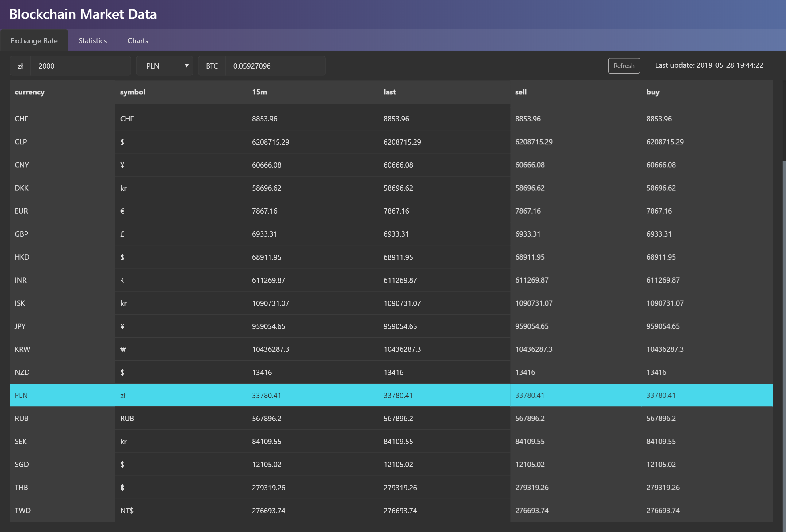
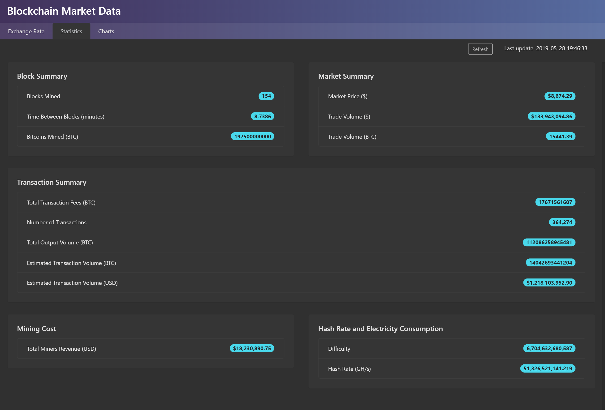

# blockchain-market-data
A web client to consume blockchain.info market data api.

  

# Getting started

## Development server

Run `npm run start` for a dev server. Navigate to `http://localhost:4200/`. The app will automatically reload if you change any of the source files.

## Code scaffolding

Run `ng generate component component-name` to generate a new component. You can also use `ng generate directive|pipe|service|class|guard|interface|enum|module`.

## Build

Run `npm run build` to build the project. The build artifacts will be stored in the `dist/` directory.

## Running unit tests

Run `npm t` to execute the unit tests via [Jest](https://jestjs.io/).

# Features

## Exchange rates and market prices

  

## Statistics

  

## Charts

  

# License
 [MIT](/LICENSE)
